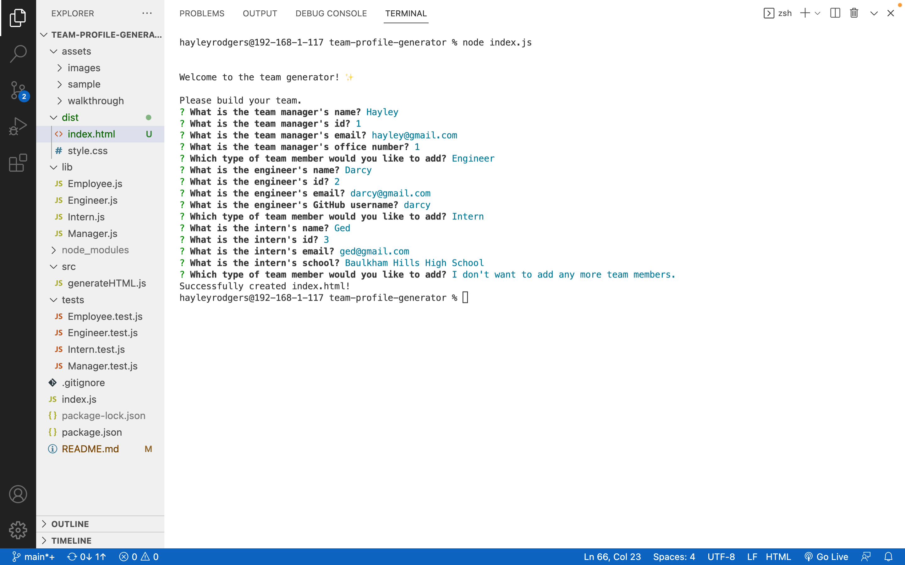
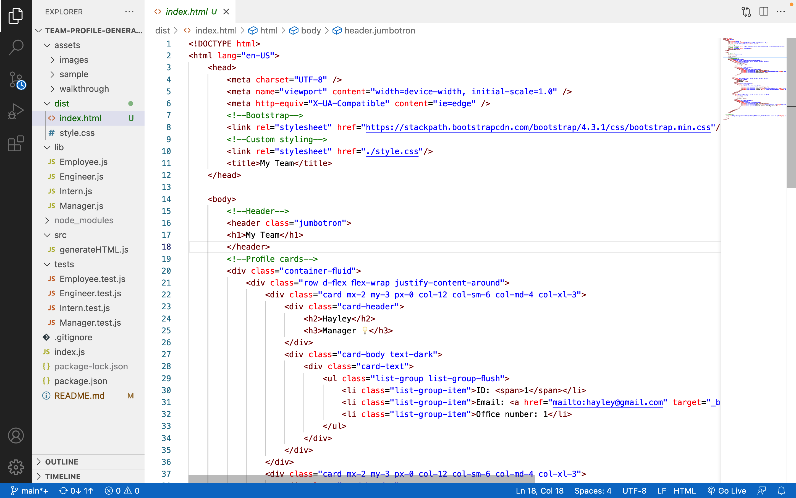

# team-profile-generator

## Table of Contents

* [Description](#description)
* [Access](#access)
* [Installation](#installation)
* [Usage](#usage) 
* [Tests](#tests)
* [Questions](#questions)

## Description

My goal for this project was to create a command-line application that takes in information about employees on a software engineering team and generates a HTML webpage that displays summaries for each person. This allows the user to quickly access the emails and GitHub profiles of the people on their team.

To achieve this, I used Javascript. In particular, I used the [Inquirer](https://www.npmjs.com/package/inquirer/v/8.2.4) package.





During this project, I consolidated my understanding of Javascript. In particular, I re-inforced what I have learnt about:
- Node.js
- npm
- Inquirer
- And, Test Driven Development.

## Access

To access the repository where the code is saved, click [here](https://github.com/hayleyarodgers/team-profile-generator).

To access a video walkthrough tutorial of the application, click [here](./assets/walkthrough/Team-profile-generator-demo-HRodgers.mp4) to access it directly or [here](https://drive.google.com/file/d/1a4XMTpvpapefcsnX_mVtx1mTkW8ijV64/view?usp=sharing) to access it via GoogleDrive.

To view a sample of a HTML file generated by the application, click [here](./assets/sample/index.HTML).

## Installation

To install necessary dependencies, run the following command:

```
npm i
```

## Usage

To use the application:
1. Open the repository in your terminal or bash.
2. In the command-line, enter ```node index.js```
3. In the command-line, answer the prompts. 

## Credits

- I used [Inquirer](https://www.npmjs.com/package/inquirer/v/8.2.4) to show prompts and collect responses from the user.
- I used [Jest](https://www.npmjs.com/package/jest)for running the unit tests.